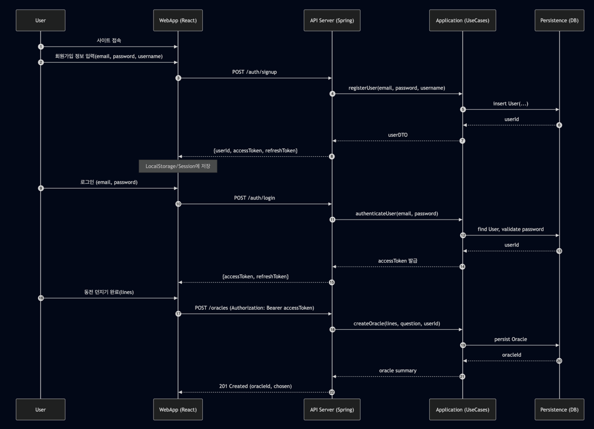
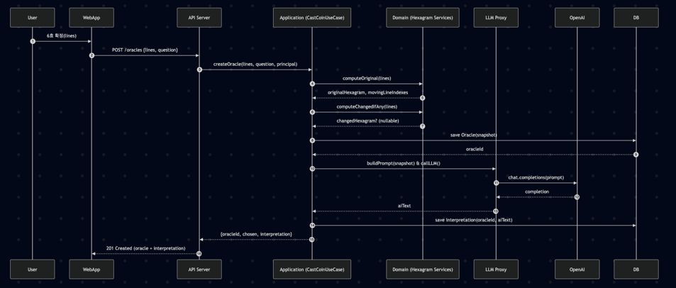
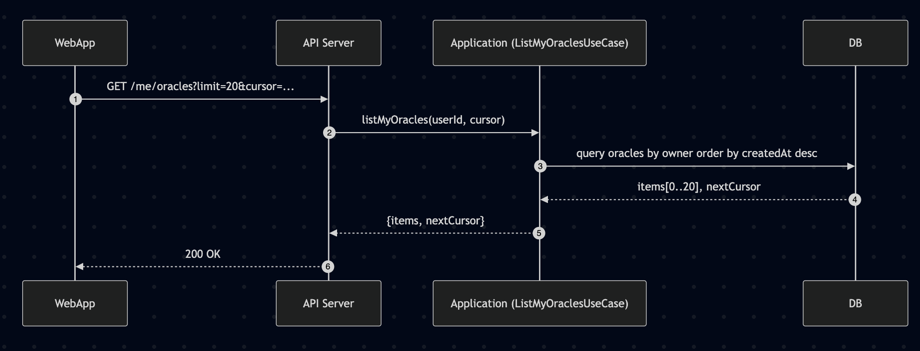
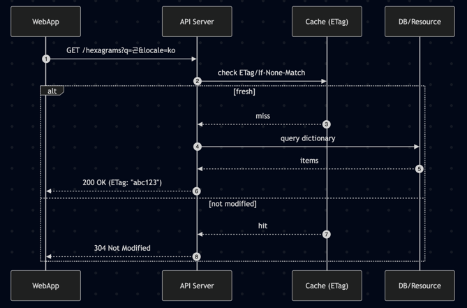
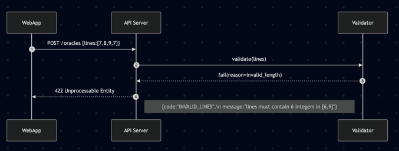
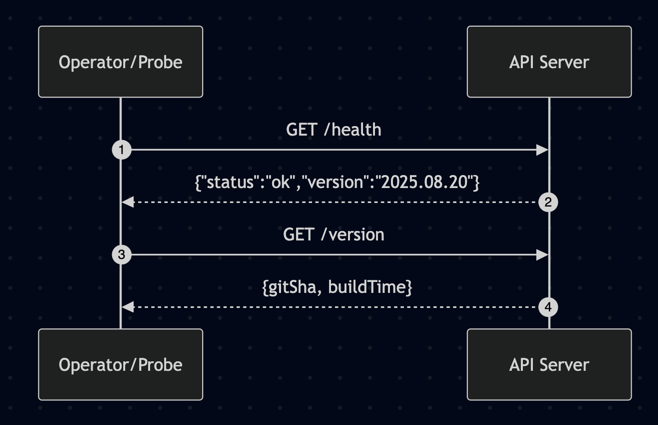

# 05. Sequence Diagrams — HexaOracle

> 모든 시퀀스는 **Mermaid** 문법으로 작성. 프론트는 React WebApp, 백엔드는 Spring Boot API Server 기준.

---

## 1) 사용자 회원가입, 로그인, 오라클 시나리오



<details>
<summary>회원가입/로그인 시퀀스 다이어그램 (Mermaid 코드)</summary>

<pre><code class="language-mermaid">
sequenceDiagram
  autonumber
  participant U as User
  participant W as WebApp (React)
  participant S as API Server (Spring)
  participant A as Application (UseCases)
  participant R as Persistence (DB)

  U->>W: 사이트 접속
  U->>W: 회원가입 정보 입력(email, password, username)
  W->>S: POST /auth/signup
  S->>A: registerUser(email, password, username)
  A->>R: insert User(...)
  R-->>A: userId
  A-->>S: userDTO
  S-->>W: {userId, accessToken, refreshToken}
  note over W: LocalStorage/Session에 저장
</code></pre>

</details>


### 회원가입 · 로그인 · Oracle 생성 플로우 설명

1. **사이트 접속**
    - 사용자가 웹 애플리케이션(React)에 접속한다.

2. **회원가입**
    - 사용자는 이메일, 비밀번호, 사용자명을 입력한다.
    - 클라이언트(WebApp)는 `POST /auth/signup` 요청을 API 서버(Spring)로 보낸다.
    - 서버는 애플리케이션 계층(UseCases)에서 `registerUser` 유스케이스를 실행한다.
    - 영속 계층(DB)에 새로운 User 레코드를 삽입한다.
    - DB는 생성된 `userId`를 반환하고, 애플리케이션 계층은 이를 DTO로 감싼다.
    - API 서버는 사용자에게 `{userId, accessToken, refreshToken}`을 반환한다.
    - 클라이언트는 토큰을 LocalStorage 또는 세션 스토리지에 저장한다.

3. **로그인**
    - 사용자는 이메일과 비밀번호로 로그인 요청을 보낸다.
    - 클라이언트는 `POST /auth/login`을 호출한다.
    - 서버는 `authenticateUser` 유스케이스를 실행하여 사용자를 조회하고 비밀번호를 검증한다.
    - 검증이 성공하면 새로운 AccessToken과 RefreshToken을 발급하여 반환한다.
    - 클라이언트는 이 토큰을 저장해 이후 요청에 사용한다.

4. **Oracle 생성**
    - 사용자가 동전 던지기(6효)를 완료하면 클라이언트는 `POST /oracles` 요청을 보낸다.
    - 요청 헤더에는 `Authorization: Bearer accessToken`이 포함된다.
    - 서버는 `createOracle` 유스케이스를 실행하여 입력된 lines, 질문, userId를 바탕으로 점괘를 생성한다.
    - 영속 계층(DB)에 새로운 Oracle 레코드가 저장되고, 생성된 `oracleId`가 반환된다.
    - 애플리케이션 계층은 Oracle의 요약 정보를 만들어 API 서버에 전달한다.
    - API 서버는 클라이언트에 `201 Created` 응답과 함께 `{oracleId, chosen}` 결과를 반환한다.

### 요약
- 게스트 토큰 기반 세션은 제거되고, 모든 플로우는 회원가입/로그인 후 JWT 인증을 거쳐 진행된다.
- 회원가입 시 최초 토큰을 발급받으며, 로그인 이후에는 동일한 방식으로 토큰이 관리된다.
- Oracle 생성은 인증된 사용자 단위로 기록이 남는다.


---

## 2) Oracle 생성 (lines 제공) — 본괘/변괘/변효 계산 (Oracle + Interpretation 동기 포함)


<details>
<summary>Oracle 생성 + 해석 시퀀스 다이어그램</summary>

<pre><code class="language-mermaid">
sequenceDiagram
  autonumber
  participant U as User
  participant W as WebApp
  participant S as API Server
  participant A as Application (CastCoinUseCase)
  participant D as Domain (Hexagram Services)
  participant L as LLM Proxy
  participant O as OpenAI
  participant R as DB

  U->>W: 6효 확정(lines)
  W->>S: POST /oracles {lines, question}
  S->>A: createOracle(lines, question, principal)

  A->>D: computeOriginal(lines)
  D-->>A: originalHexagram, movingLineIndexes
  A->>D: computeChangedIfAny(lines)
  D-->>A: changedHexagram? (nullable)

  A->>R: save Oracle(snapshot)
  R-->>A: oracleId

  %% Interpretation 즉시 실행
  A->>L: buildPrompt(snapshot) & callLLM()
  L->>O: chat.completions(prompt)
  O-->>L: completion
  L-->>A: aiText
  A->>R: save Interpretation(oracleId, aiText)

  A-->>S: {oracleId, chosen, interpretation}
  S-->>W: 201 Created (oracle + interpretation)
</code></pre>

</details>


### Oracle 생성 (동전 던지기 → Oracle 확정 + 해석 포함)

1. **사용자 입력**
    - 사용자가 동전을 6번 던져 6효(`lines`)를 확정한다.

2. **클라이언트 요청**
    - 웹앱(WebApp)은 `POST /oracles` API 호출 시 `lines`, `question`, 인증된 사용자 정보(`principal`)를 보낸다.

3. **서버 처리 (Application)**
    - API 서버는 `createOracle(lines, question, principal)` 유스케이스를 실행한다.
    - Application은 Domain 서비스에 두 가지 처리를 위임:
        1. `computeOriginal(lines)` → 본괘(`originalHexagram`)와 변효 인덱스(`movingLineIndexes`) 산출
        2. `computeChangedIfAny(lines)` → 변괘(`changedHexagram`) 계산

4. **DB 저장**
    - 산출된 Oracle 스냅샷을 DB에 저장하고 `oracleId`를 발급받는다.

5. **LLM 해석 요청**
    - Application은 즉시 LLM Proxy를 통해 Prompt를 생성하고 LLM API(OpenAI 등)에 요청한다.
    - 응답받은 `aiText`를 `Interpretation` 엔티티로 DB에 저장한다.

6. **응답 반환**
    - Application은 `{oracleId, chosen, interpretation}` 결과를 API 서버로 전달한다.
    - API 서버는 `201 Created` 응답으로 클라이언트에 반환한다.
    - 클라이언트는 점괘와 해석을 한 번에 표시할 수 있다.


## 3) 히스토리 조회 (커서 페이지네이션)


<details>
<summary>Oracle 히스토리 조회 (커서 페이지네이션)</summary>

<pre><code class="language-mermaid">
sequenceDiagram
  autonumber
  participant W as WebApp
  participant S as API Server
  participant A as Application (ListMyOraclesUseCase)
  participant R as DB

  W->>S: GET /me/oracles?limit=20&cursor=...
  S->>A: listMyOracles(userId, cursor)
  A->>R: query oracles by owner order by createdAt desc
  R-->>A: items[0..20], nextCursor
  A-->>S: {items, nextCursor}
  S-->>W: 200 OK
</code></pre>

</details>

### Oracle 히스토리 조회 (커서 페이지네이션)

1. **클라이언트 요청**
    - 사용자가 마이페이지나 기록 화면에서 점괘 히스토리를 확인하려고 한다.
    - 웹앱(WebApp)은 `GET /me/oracles?limit=20&cursor=...` 요청을 API 서버로 전송한다.
        - `limit` = 한 번에 가져올 개수
        - `cursor` = 마지막으로 본 `oracleId` 또는 `createdAt` 기준

2. **서버 처리 (Application)**
    - API 서버는 `listMyOracles(userId, cursor)` 유스케이스를 실행한다.
    - Application 계층은 DB에 쿼리를 위임한다:
        - `owner = userId` 조건으로
        - `createdAt DESC` 정렬
        - `cursor` 이후의 항목부터 `limit+1`개 조회

3. **DB 반환**
    - DB는 요청한 사용자 소유의 점괘 목록(`items`)과 다음 페이지 탐색을 위한 `nextCursor`를 반환한다.
    - `nextCursor`는 마지막으로 가져온 항목의 `createdAt`이나 `id`로 설정된다.

4. **응답 반환**
    - Application은 `{items, nextCursor}`를 API 서버에 전달한다.
    - API 서버는 이를 `200 OK` 응답으로 클라이언트에 반환한다.
    - 웹앱은 받아온 `items`를 화면에 렌더링하고, 스크롤이나 “더 보기” 요청 시 `nextCursor`를 이용해 다음 페이지를 요청한다.


---

## 4) 64괘 사전 조회


<details>

<summary>Hexagram 사전 조회 (ETag 캐싱)</summary>

<pre><code class="language-mermaid">
sequenceDiagram
  autonumber
  participant W as WebApp
  participant S as API Server
  participant C as Cache (ETag)
  participant R as DB/Resource

  W->>S: GET /hexagrams?q=곤&locale=ko
  S->>C: check ETag/If-None-Match
  alt fresh
    C-->>S: miss
    S->>R: query dictionary
    R-->>S: items
    S-->>W: 200 OK (ETag: "abc123")
  else not modified
    C-->>S: hit
    S-->>W: 304 Not Modified
  end
</code></pre>

</details>

### Hexagram 사전 조회 (ETag 캐싱)

1. **클라이언트 요청**
    - 사용자가 특정 괘(예: "곤")에 대한 해석 사전을 조회한다.
    - 웹앱(WebApp)은 `GET /hexagrams?q=곤&locale=ko` 요청을 전송한다.
    - 이때 브라우저는 이전 응답에서 받은 `ETag` 값을 `If-None-Match` 헤더에 포함시킬 수 있다.

2. **API 서버 캐시 확인**
    - API 서버는 캐시 레이어(ETag 저장소)를 확인한다.
    - 클라이언트가 보낸 `If-None-Match` 값과 현재 서버 리소스의 `ETag`를 비교한다.

3. **캐시 미스(fresh 데이터 필요)**
    - 캐시에 해당 항목이 없거나 `ETag`가 다르면 → **캐시 미스**.
    - 서버는 DB/리소스 계층에 쿼리를 날려 사전 데이터를 조회한다.
    - DB는 `items`(괘 해석 데이터)를 반환한다.
    - 서버는 `200 OK` 응답과 함께 새로운 `ETag` 값을 헤더(`ETag: "abc123"`)에 실어 클라이언트에 돌려준다.

4. **캐시 히트(not modified)**
    - 클라이언트의 `If-None-Match`가 서버의 최신 `ETag`와 같다면 → **캐시 히트**.
    - 서버는 `304 Not Modified` 응답을 반환한다 (본문 데이터 없음).
    - 클라이언트는 기존 캐시된 데이터를 그대로 사용한다.

5. **효과**
    - 동일한 사전 데이터에 대한 반복 조회 시, 불필요한 DB 조회와 네트워크 비용을 절감한다.
    - 클라이언트는 빠르게 화면에 캐시된 데이터를 표시할 수 있다.


---

## 5) 오류 시나리오 — 유효하지 않은 lines


<details>
<summary>오류 시나리오 — 유효하지 않은 lines</summary>

<pre><code class="language-mermaid">
sequenceDiagram
  autonumber
  participant W as WebApp
  participant S as API Server
  participant V as Validator

  W->>S: POST /oracles {lines:[7,8,9,7]}
  S->>V: validate(lines)
  V-->>S: fail(reason=invalid_length)
  S-->>W: 422 Unprocessable Entity
  Note right of S: {code:"INVALID_LINES",\n message:"lines must contain 6 integers in [6,9]"}
</code></pre>

</details>

### 오류 시나리오 — 유효하지 않은 lines

1. **잘못된 요청**
    - 사용자가 동전을 던진 결과(`lines`)를 잘못 전달한다.
    - 예: `[7,8,9,7]` → 4개밖에 없는 경우.

2. **서버 검증 단계**
    - API 서버는 Validator에 `lines` 유효성을 검사하도록 위임한다.
    - 규칙: `lines`는 반드시 길이가 6이고, 각 값은 6~9 범위의 정수여야 한다.

3. **검증 실패**
    - Validator는 `invalid_length` 오류를 반환한다.

4. **에러 응답**
    - API 서버는 `422 Unprocessable Entity` 상태 코드로 클라이언트에 오류를 전달한다.
    - 응답 바디 예시:
      ```json
      {
        "code": "INVALID_LINES",
        "message": "lines must contain 6 integers in [6,9]"
      }
      ```

5. **의미**
    - 잘못된 입력을 조기에 차단함으로써 DB 저장이나 불필요한 도메인 연산을 방지한다.
    - 클라이언트는 즉시 오류 메시지를 사용자에게 보여줄 수 있다.


---

## 6) 시스템 헬스체크 & 버전

<details>
<summary>시스템 헬스체크 & 버전</summary>

<pre><code class="language-mermaid">
sequenceDiagram
  autonumber
  participant Ops as Operator/Probe
  participant S as API Server

  Ops->>S: GET /health
  S-->>Ops: {"status":"ok","version":"2025.08.20"}

  Ops->>S: GET /version
  S-->>Ops: {gitSha, buildTime}
</code></pre>

</details>

### 시스템 헬스체크 & 버전

1. **헬스체크 (Health Endpoint)**
    - 모니터링 시스템(Operator/Probe)은 API 서버의 `/health` 엔드포인트를 호출한다.
    - 서버는 현재 상태와 배포 버전을 JSON으로 응답한다.
    - 예:
      ```json
      {
        "status": "ok",
        "version": "2025.08.20"
      }
      ```

2. **버전 정보 (Version Endpoint)**
    - 운영자는 배포된 애플리케이션의 Git SHA 및 빌드 시간을 확인하기 위해 `/version` 엔드포인트를 호출할 수 있다.
    - 서버는 빌드 시점에 주입된 메타데이터를 응답한다.
    - 예:
      ```json
      {
        "gitSha": "abc123def456",
        "buildTime": "2025-08-20T07:00:00Z"
      }
      ```

3. **의미**
    - `GET /health`: 로드밸런서, 쿠버네티스 liveness/readiness probe, 모니터링에서 주기적으로 호출 → 서비스 상태 감시.
    - `GET /version`: 특정 배포가 어떤 코드 기반에서 빌드되었는지 추적 가능 → 디버깅 및 롤백 시 활용.


---

### 메모

* 다이어그램의 컴포넌트 명칭은 02-architecture.md와 일치하도록 표기했습니다.
* 해석 전달 방식은 **폴링**을 기본으로, **SSE/웹소켓**으로 대체 가능(4번 다이어그램의 loop 블록 참조).
* 게스트 토큰 발급은 요구사항(01-requirements.md 2.1)을 반영한 예시이며, 실제 API Spec에 맞춰 엔드포인트 명을 조정하세요.

---
