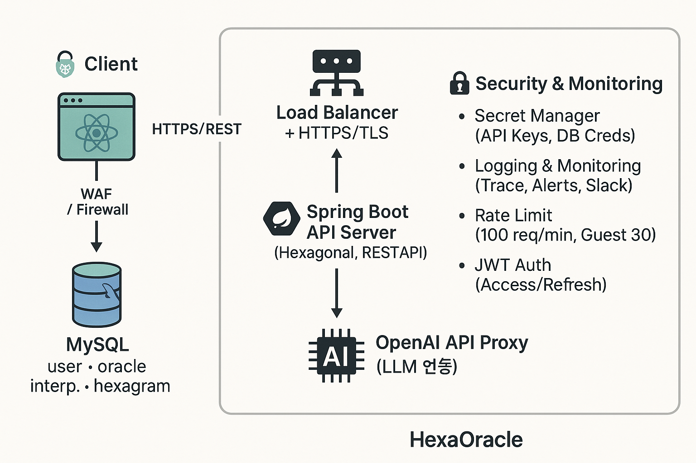

# 07. Infra — HexaOracle

## 1) 개요

HexaOracle 인프라 구성은 **React WebApp**과 **Spring Boot API Server**를 중심으로, MySQL DB, Redis 캐시/큐, OpenAI API Proxy를 통합한 클라우드 네이티브 아키텍처로 설계되었다. 보안 및 모니터링 계층을 포함하여 안정성과 확장성을 고려한다.

---

## 2) 인프라 구성도

### 구성 요소 설명

* **Client (React WebApp)**

    * PC/Mobile 환경 지원
    * HTTPS 기반 API 호출

* **WAF / Firewall**

    * 외부 공격 방어 및 유효 트래픽만 허용

* **Load Balancer + HTTPS/TLS**

    * 모든 요청은 LB를 통해 API 서버로 전달
    * SSL 종료 및 요청 분산 처리

* **Spring Boot API Server (Hexagonal, REST API)**

    * 헥사고날 아키텍처 기반 도메인/애플리케이션/어댑터 계층 분리
    * REST API 제공, JWT 인증 적용

* **MySQL 8.x**

    * user/oracle/interpretation/hexagram 스키마 저장
    * 인덱스 및 커서 기반 페이지네이션 최적화【23†source】

* **Redis**

    * Job Queue, 캐시 저장소로 활용
    * 비동기 AI 해석 Job 관리 및 API Rate Limit 보조

* **OpenAI API Proxy (LLM 연동)**

    * Oracle 스냅샷 + 질문을 기반으로 Prompt 생성 후 AI 해석 요청
    * 해석 결과는 interpretation 테이블에 저장【21†source】

* **Security & Monitoring**

    * Secret Manager: DB 크리덴셜, API Key 보관
    * Logging & Monitoring: Request Trace, Alerts, Slack 연동
    * Rate Limit: 100 req/min (Guest 30)【19†source】
    * JWT Auth: Access/Refresh Token 발급

---

## 3) 운영 고려 사항

* **확장성**: 모든 컴포넌트는 컨테이너(Docker) 기반으로 배포 가능, 수평 확장 용이.
* **보안**: TLS/HSTS, CORS 화이트리스트, 입력 검증, 비밀 관리 적용【24†source】.
* **관측성**: 로깅/모니터링 시스템을 통해 API 호출, DB 쿼리, LLM 지연 모니터링.
* **CI/CD**: main 브랜치 태깅 시 배포 자동화, 도커 이미지 및 정적 번들 생성【22†source】.

---

## 4) 결론

HexaOracle 인프라는 **MVP 단계에서의 단순성**과 **확장성 확보**를 동시에 목표로 한다. React–Spring Boot–MySQL–Redis–OpenAI API Proxy를 기본 축으로 하여, 보안/모니터링 계층을 더해 안정적으로 서비스 운영이 가능하도록 설계되었다.
